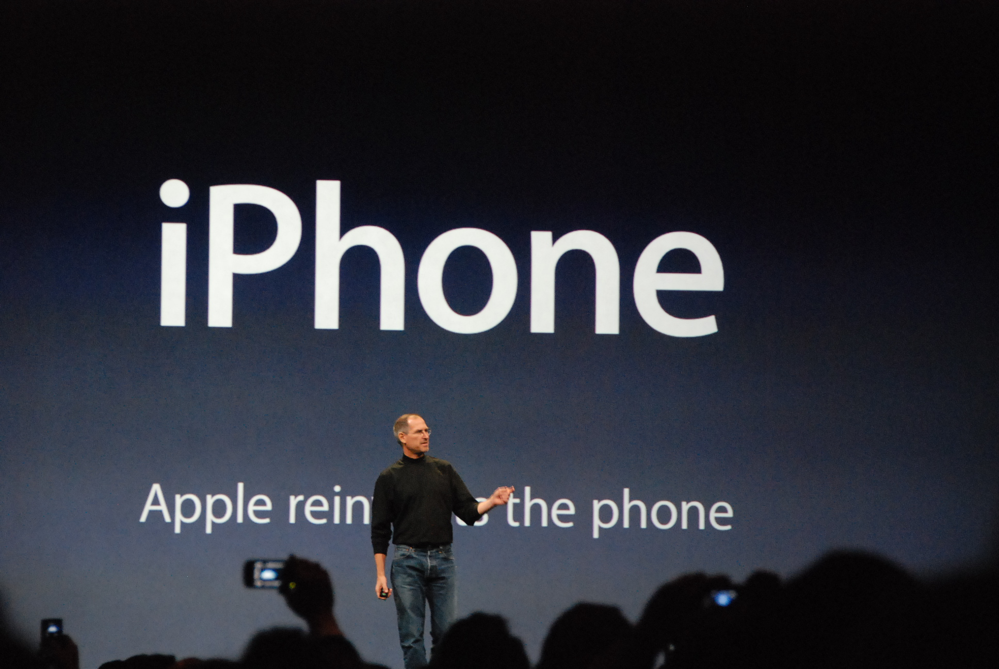
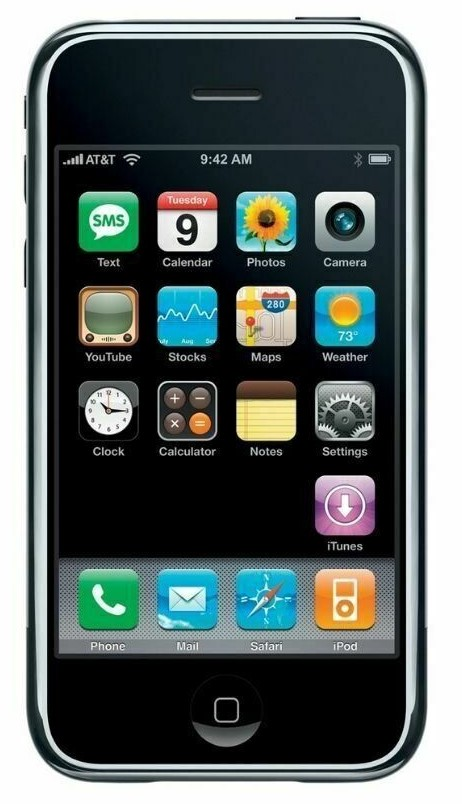

Before reading on, I’d like you to do one thing. If you're on your iPhone, scroll to the bottom of this page.

Notice how it gently stretches a bit past the edge and the springs back? You’ve likely never noticed this, but you’ve probably seen it thousands of times without thinking about it. But your brain knew instantly what it meant; that it was the end of the page. No message, no scrollbar, just a feeling.

That wasn't an accident. Apple designed that [bounce](https://patents.google.com/patent/US7469381B2/en) for the very first iPhone, so the end of a page would feel like something rather than just stop. It's a tiny detail, but it's the kind that makes technology disappear into your hands. As we move toward AI, smart glasses and voices in our ears, I think that's what matters most: the best technology is the kind you forget you're using.

<figure class="essay-figure">

<figcaption>Steve Jobs introduces the first iPhone, 9 January 2007. Photo: <a href="https://commons.wikimedia.org/wiki/File:Steve_Jobs_presents_iPhone.jpg">Blake Patterson</a> · <a href="https://creativecommons.org/licenses/by/2.0/">CC BY 2.0</a>.</figcaption>
</figure>

The graphical user interface (GUI) was first developed in the 1970s at Xerox PARC, a research facility in Palo Alto, California, for their computer, the [Xerox Alto](https://www.computerhistory.org/revolution/input-output/14/347). However, it would later become widespread thanks to Apple's [Macintosh in 1984](https://www.computerhistory.org/revolution/artifact/303/1203). This was significant because, before this, users would interact with the computer by typing complex text commands into the command line. The early GUI was important as it added things such as windows, icons and a pointer!

<figure class="essay-figure essay-figure--phone">

<figcaption>The iPhone OS 1 home screen on a first-generation iPhone. Image: <a href="https://commons.wikimedia.org/wiki/File:IPhone_1_and_iPhone_OS_1.jpg">Avicente05, cropped by YuCheinSYQ</a> · <a href="https://creativecommons.org/licenses/by/4.0/">CC BY 4.0</a>.</figcaption>
</figure>

This is important as it changed how we humans interact with technology. The simple fact of having a window with an icon that you can click on made it more intuitive for the user to complete actions. Now I ask you for another favour, open Microsoft Word. Have you ever noticed that the icon for "Save" is a floppy disk? Or that to return home you click a home icon, and even "Print" is an actual printer?

If we go back to the early iPhones, a lot of the first apps were heavily skeuomorphic. The Calculator app looked like a real calculator. The Clock app looked like a real clock, and so on. Later, Apple would get rid of this design and move its OS to a [flat design](https://www.apple.com/newsroom/2013/06/10Apple-Unveils-iOS-7/). In fact, Apple would push the boundary a bit more with how we interact with the iPhone. With the [iPhone 7](https://www.apple.com/newsroom/2016/09/apple-introduces-iphone-7-iphone-7-plus/), it got rid of the physical home button and replaced it with a haptic feedback button, which mimicked the original home button using vibration motors. This then led Apple to pave the way for gestures with the [iPhone X](https://www.apple.com/newsroom/2017/09/the-future-is-here-iphone-x/).

You may now be asking why I’ve given you this brief history on how the GUI and physical buttons has evolved as technology evolves. Well, with the rise of AI and things such as [Meta's glasses](https://www.meta.com/smart-glasses/) and [Apples Apple vision](https://www.apple.com/apple-vision-pro/). I think one thing that will be important for our future is how we interact with technology as it moves beyond physical devices. I don't know what's to come, but I think it's important that we think about how we interact with these things, whether that means creating a new kind of interface or researching more intuitive ways of using these technologies. As developers, we need to think about how the user interacts with what we build.

Although I don't have the answer, I do have a feeling that voice and vision will be a big part of it. One example is [OpenAI](https://openai.com/)'s latest model, GPT-6 Astra, which can use your computer for you. It's only one way we might interact with technology. Using your voice is genuinely useful, but I still think there are edge cases. Would you tell Astra, or future models, to "close this tab" and "open that one"? Or would you just point? I don't feel that's exactly how we will be interacting with technology.

As we build software, even small software for ourselves, I think it's important not to forget this philosophy of how we interact with technology.
